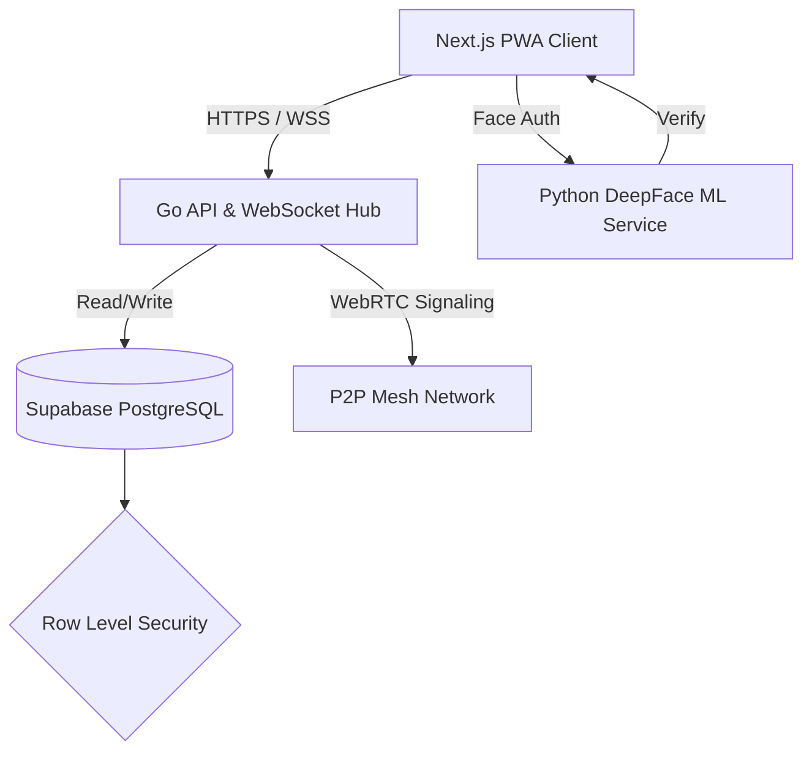

# LoveWithYou - Enterprise-Grade Connection Platform 💘

> A highly scalable, real-time Progressive Web App (PWA) dating and social platform designed to showcase full-stack engineering, robust security, and distributed systems architecture.

---

## 📖 12. Context: Problem → Solution → Result

**The Problem:** Modern social applications require extremely low latency for real-time interactions (chatting, WebRTC audio/video) while ensuring high user safety, data privacy, and protection against fraudulent activities (bots, catfishing, replay attacks).
**The Solution:** Architected a microservices-based platform decoupling the real-time engine (Go), the frontend client (Next.js), and the machine learning safety engine (Python/Flask). Enforced strict zero-trust security at the database layer using Row Level Security.
**The Result:** A highly performant, secure platform capable of handling concurrent WebRTC signaling and real-time chat with integrated biometric verification and anti-fraud mechanics.

---

## 🏗️ 9. Architecture Diagram



---

## 🛠️ 10. Tech Stack

- **4. Frontend:** Next.js 16 (App Router), React, TypeScript, Tailwind CSS, Zustand, Framer Motion
- **3. API & Backend:** Go (Golang), Gorilla Mux (REST & WebSockets), WebRTC
- **ML Microservice:** Python, Flask, DeepFace, OpenCV
- **2. Database:** Supabase (PostgreSQL) with strict Row Level Security (RLS)
- **5. Deployment:** Vercel (Frontend), Render (Go Backend & ML Service), GitHub Actions (CI/CD)

---

## 🔐 1. & 11. Security & Authentication Considerations

Security is treated as a first-class citizen in this architecture:
- **Authentication:** Stateless JWT-based authentication provided by Supabase Auth. Admin panels use secure, HTTP-only fragmented cookies with Base64 encrypted identities.
- **Row Level Security (RLS):** Database queries bypass backend bottlenecks directly from the client but are strictly gated by PostgreSQL RLS policies ensuring users can only read/write their own `device_id` scoped data.
- **Idempotency & Anti-Replay:** The Go backend implements a custom `IdempotencyMiddleware` using `X-Request-ID` headers to categorically prevent double-spending of virtual currency and replay attacks.
- **Biometric Safety:** A dedicated Python microservice enforces real-time face verification and age estimation to combat bots.
- **SOS Check-ins:** Physical date tracking with automated panic triggers stored securely in the database.

---

## ⚡ 6. Error Handling & Resilience

- **Frontend Boundaries:** Next.js Error Boundaries catch and isolate UI crashes. Zustand maintains optimistic UI states with automatic rollbacks on API failures.
- **Backend Recovery:** Go WebSocket hubs feature automated dead-connection pruning, ping/pong heartbeats, and graceful panic recoveries.

---

## 🧪 7. Testing Strategy

- **Unit Testing:** Go standard library `testing` for API endpoints and idempotency logic.
- **E2E Testing:** Critical user flows (Match -> Chat -> Unmatch) verified to ensure WebRTC signaling integrity and database state consistency.

---

## 📚 13. Documentation & Project Structure

The repository is organized into domain-specific micro-environments:
- `/dating-pwa`: The Next.js frontend application.
- `/backend`: The Go-based real-time WebSocket and API server.
- `/ml_service`: Python Flask application for AI verification.

### 🚀 Local Setup

1. **Frontend:**
   ```bash
   cd dating-pwa
   npm install
   npm run dev
   ```

2. **Backend:**
   ```bash
   cd backend
   go mod tidy
   go run cmd/api/main.go
   ```

3. **ML Service:**
   ```bash
   cd ml_service
   pip install -r requirements.txt
   gunicorn app:app
   ```
